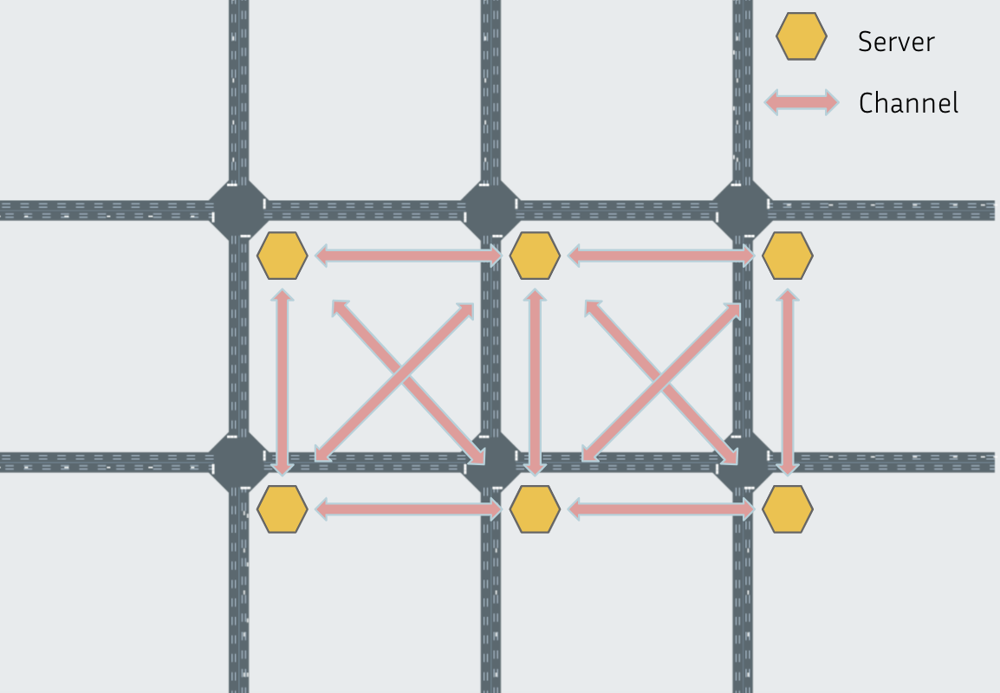
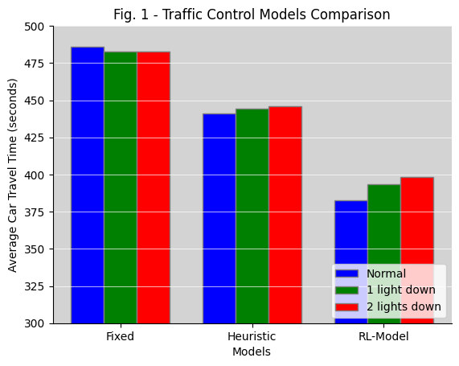
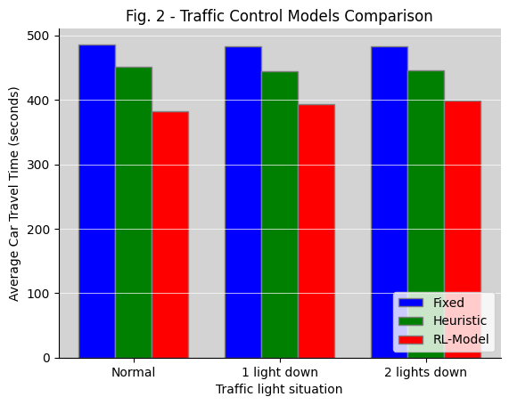

# See CS262_Final_Report.pdf for updated report!

## Introduction and Motivation

Traffic signal control is one of the most challenging optimization problems that affects many peoples' everyday lives. Nonetheless, the large majority of traffic control methods in the U.S. and across the globe use fixed-timing methods, where depending on the day of the week and the time of day, traffic lights at an intersection turn green for a fixed amount of time in a loop. Although this seems naive, traffic engineers spend many hours in the field tuning how long each phase (or direction) is given a green light. In fact, traffic theory has derived optimal phase lengths for various queue lengths (a queue for a lane is the number of cars waiting to pass through the intersection in that lane). Traffic engineers use vehicle volume data collected at the intersection of interest to determine how long they expect queues to be at certain times of day and use that to program how long to keep the phase green. 

Unfortunately, fixed-timing phase lengths are often suboptimal and cannot adapt to local traffic conditions such as accidents, spectator events, holidays, simple day-to-day variation, or other factors. To combat this, some traffic companies began deploying ``adaptive algorithms'' which measure the vehicle volume data live and estimate the queue length accordingly. Although these algorithms are often successful at reducing wait times at individual intersections, they struggle at coordinating traffic across many intersections in a network as they are not explicitly designed to reduce average total travel time.   

As a result, most algorithms deployed today still use fixed-timing phase lengths. The burden is placed on traffic engineers to coordinate multiple intersections along major streets to minimize the number of times cars need to wait at individual intersections. However, such coordination of a large traffic network is a very difficult task, and often improvements are made only heuristically by finding specific sets of intersections that are holding up traffic. In this research, we employ distributed systems and reinforcement learning to optimize traffic signal control for traffic networks to allow for dynamic control suitable for a wide variety of live conditions and the ability to scale naturally to large traffic networks. Although reinforcement learning methods have been researched to this end, they have either limited themselves to simple non-distributed implementations (i.e. traffic lights do not share sensor data) or not tested themselves in a distributed manner (i.e. been developed but only tested on a single process with all environment data available to it). In this work, we design a scalable distributed system to allow for efficient traffic control. Our results show that when allowing traffic lights to communicate information, reinforcement learning methods can have significantly outperform heuristic and fixed timing methods. Moreover, we can design the distributed system to be robust to node and sensor failure so that traffic remains as optimized as possible if components of the system go down.

## Related Work 

There are two previous works in the reinforcement learning for traffic domain that this paper will be building off of, PressLight and CoLight. Both of these methods are optimized for big-city traffic where the number of cars is regularly close to the total number of cars that can fit on the streets, as opposed to suburban or rural traffic where streets run for much longer between intersections and are rarely at capacity. We review both of these approaches and look at their shortcomings in the suburban/rural traffic setting.

### PressLight

PressLight is a DQN-based method that formulated a less-heuristic reward function than previous approaches based on the maximum pressure of an intersection. Maximum pressure is a state-of-the-art method used in non-RL adaptive traffic algirthms and is based on the idea of balancing the number of cars on incoming and outgoing lanes into an intersection. As such, the reward function for the agent controlling intersection $i$ in PressLight is defined as:
$$
    r_i = -P_i = \left| \sum_{l_{in} \in L_{in}} \frac{n(l_{in})}{c(l_{in})} - \sum_{l_{out} \in L_{out}} \frac{n(l_{out})}{c(l_{out})}  \right|
$$
where $n(l)$ is the number of cars in a lane $l$, $c(l)$ is the maximum number of cars that can fit on lane $l$ (capacity of the lane), and $L_{in}$ and $L_{out}$ are the set of incoming and outgoing lanes into intersection $i$. This formulation already has a problem in that each intersection needs to have its own agent, which can complicate training, although parameter sharing can be used at the cost of potential performance. 

Furthermore, the reward function is tightly coupled to the capacity of each lane connecting to the intersection ($c(l)$), which makes sense in the context of tight, packed streets in New York and Beijing, but fails to generalize to suburban or rural settings where streets have much larger capacities. Traffic is still a major problem in these kinds of settings, and inefficient traffic signal control can increase travel times during peak hours by many seconds per intersection. Consequently, our reward function will not allow the lanes' capacities to have such a large influence on the reward, although it will still include a penalty term if the capacity of the lane reaches a certain threshold (see Methods).

However, the biggest difference between PressLight and the methods explored in this research is the state space. The majority of research in the RL and traffic domain allows for the agent(s) to see a very complete picture of the state, that is, exactly the number of cars in each of the lanes. In PressLight, each lane is broken up into 3 equal-sized segments, and each agent can see how many vehicles are on each segment of each lane. In real life, having such fine-grained information on the state would only be possible with cameras attached to each intersection facing multiple directions or for cars to report where they are at all times. Installing cameras at intersections is expensive, and even a cost like this can be enough to deter a city from adopting a more efficient traffic control method (this is why over 99\% of intersections in the U.S. are still controlled with fixed timing methods). In the Methods section below, we outline the state information we are using which aligns exactly with the infrastructure that cities might already have. Of course, having a richer state space helps improve performance, so we expect our methods to be upper bounded in performance by PressLight and related methods, all other components being held equal. 

### CoLight

CoLight, another DQN-based architecture, was a follow-up paper to PressLight that used an attention-based architecture to encode information from neighboring intersections into the state space. CoLight explicitly used the same agent for each intersection, allowing it to scale efficiently to maps with hundreds of intersections. At each layer, the hidden state from neighboring intersections would be fed into an attention module and aggregated accordingly to get the next hidden state. Thus, with many attention layers stacked together, an intersection could receive information from any other intersection on the map (since its neighbors would encode information about their neighbors, and so on). Although this allows for easier coordination between intersections as intersections are sharing information, it requires $O(NL)$ communications between controllers at intersections to even make a single action prediction for a single agent ($N$ is the number of neighboring intersections, and $L$ is the number of attention layers in the model). Thus, employing CoLight in the real-world would require very reliable and fast communication protocols between intersections. This would also require a replacement of most traffic controllers and thus is not practical in most cities. Instead, we leverage a common agent that operates at each intersection independently to allow for implicit communication.

CoLight's state space is very similar to PressLight's. We hope to constrain ourselves to a much simpler state space that is similar to the data that might be available to traffic algorithms in cities and towns.

## Implementation Details

**Simulator Setup**. In order to simulate our environment, we use `CityFlow`, an open-source simulator traffic environment that allows for customizable road structures that can be imported from city planning specific document types. Additionally, the simulator allows for changing and creating different types of car flows and paths which is key in the flexibility needed to model a myriad of traffic situations. Most of the data collection API was built on top of CityFlow's data API. We also added a `CustomEngine` object to specifically control and calculate relevant metrics as well as a custom environment object wrapper to facilitate the data aggregation for relevant metrics required by the reinforcement learning model. 

**Test Bed**. Using the city flow formatting tool, we created a 3 by 2 grid of 4-way intersections. Each intersection has 6 phases that delineate specific road and lanes to move such that collisions can be avoided. In the fixed timing schema, each intersection alternates timing between phases 1, 2, 3 $\cdots$ etc. between 30 seconds and 5 seconds where 30 seconds is reserved for only forward moving traffic and 5 seconds is for phases involving turning traffic. These timings follow from common practice and have been used in other baselines for traffic modelling as well. Later in this paper we will discuss the effect of broken traffic lights. We maintain the common assumption that if a traffic light does breakdown, then the intersection will default to a stop light where by order of arrival at the light, one car will cross the intersection at a time unless both cars are travelling in the exact opposite direction. If that is the case then two cars may cross the intersection at the same time. We illustrate our aforementioned setup the following figure:

**Communication Protocol**. Each traffic server is running their own gRPC server such that messages for data transfer can be sent and received over gRPC protocol. Each server is running a secure channel using a pre-determined SSL configuration file which endows each traffic server with a public certificate and a private key that is known only to each server. This is crucial to maintaining a layer of security for the servers as insecure channel communication can lead the intersection server array subject to cybersecurity issues such as communications monitoring and data manipulation. Moreover, in order to maintain further security integrity: each server contains a dictionary of validated API tokens and switches through them for validating data transmission messages. New data cannot be written to a receiving server's global state without one of these validated API tokens. Having multiple tokens allows for replication security where if one token is compromised, it is not necessary that all messages on the network will then become compromised as a result. In our gRPC protocol we also maintain a version field for all future reverse-compatibility logic. 

**Data Transfer**. Aside from these security measures, we delineate two main types of communications between nodes. One is `HeartBeat` messages and the other is `DataTransmission` messages. The goal of the `HeartBeat` protocol is to ensure that a specific node is active. At each clock cycle, each node sends a heartbeat message to the other nodes which are expecting this message in order to update their understanding of their neighbor's state. Each heartbeat message is validated with the intersection id and the API token which serve as a sort of username and password lock for the receiving server to view the message as a valid piece of data. Moreover, the heart beat contains the `phase_id` for the reporting intersection which then allows the other intersections to maintain a local structure that contains the status of each neighboring node. This local structure is then fed back into the reinforcement learning model which requires the history and snapshot of the whole system state in order to make a globally optimal decision. Additionally, this local structure serves the purpose of informing a node which sensor data will likely be reliable. For example, if a heartbeat for a node is lagging behind then the confidence value for that node's sensor information will also go down. If a node stops transponding for a given time interval it is declared dead where no new information can be sourced from it further. Having confidence values for each node helps with weighted averaging of node sensor values where two commit logs record sensor data at the same timestamp and a consensus has to be achieved on what is the right value. Note that even if one node goes down, most of their lane values will continue to be reported by neighboring intersections that share a lane with the affected intersection. This allows for some redundancy with sensor values such that traffic can still be optimized in parts of the grid where a traffic node goes down. Note however, that if two neighboring intersections fail, then the lanes between them will have no new reported sensor data. Instead, it will remain the historical average for the model when passed in as input. 

**Per Node Server Threads**. On each node there is a communication receiving thread pool that is managed by the gRPC client where we delineate the protocol for actions and logic upon receiving a new message. On top of this we have an update thread which has the job of collecting the sensor values and then packaging the information to send out a data transmission and a heartbeat every clock cycle. We have this in a separate thread than the thread that decides which phase cycle the light should enact given the sensor information because the data transmission thread could deal with the issue of a faulty node. In that case, the faulty node has 5 seconds to send something back before it is declared in active. However, in the process of waiting for this node, if the control logic for the phase id was on the same thread, then the light would be stuck while waiting to get a response back from other nodes which causes a multitude of problems. For example if there is higher latency then that affects the control logic phase time unexpectedly in a way that the system cannot anticipate. Due to this separation, we then need locking mechanisms per server to protect the per server global variables that maintain information on other nodes to prevent race conditions from occurring. 

**Fault-Tolerance Overview**. If a node goes down the following logical steps take place based on our system implementation. First, the sensor values for the lanes for the failed node are sourced from the exiting and entering lanes from the neighboring intersections. Additionally, the RL model can take the state of the failed intersection into account when planning for the actions of each of the intersections. Up to three non-neighboring nodes can fail before the system starts to lose sensor information in our 3 by 2 grid. Since the RL-model is running on each individual server (we chose to make it small so that it could be run on a per-thread basis) we are no longer dependent on a central server. In the central server model which is the case for many real traffic systems today, if the central control server fails, that would trigger a node failure amongst all worker nodes. Having de-centralized control benefits us in this situation. Additionally, if the thread that handles the machine learning model logic fails, the thread can default to fixed timer or heuristic control. So at multiple levels of failure, traffic optimization can still occur. Lastly, if somehow the secure channels were compromised then our API token authentication would provide a last-defense of security. Additionally, each server rotates through a set of valid tokens, so even if a token was exposed, that would only comprimise a fraction of messages from a single server. On the data transfer side, if the server sending the data does not get a confirmation response, then the server sends another packet for a number of retry attempts. This is help overcome potential packet loss or data interference. 

## Model and Control Logic

**Heuristic Methodology**. Before conducting the work required in training a high complexity neural network using reinforcement learning, we first attempt a simple heuristic model of our own design to test against the baseline. This serves as a common sense control that proves at a basic level that incorporating sensor information into the decision making of the light can improve traffic quality. The equation for the model is as follows:

$\texttt{Phase Length} = \texttt{Number of Cars In Entering Lanes} + \texttt{Standard Phase Time} - \texttt{Number of Cars in Exiting Lanes}$

The logic for this is as follows, essentially we would want the number of cars that each phase effects to be a weight for the time it takes for the phase to finish. The more cars that can be moved by a phase activating, the better it is for flow. However, we want the phase to be active for some amount of time to help move out cars that do not have many cars waiting at the intersection. Hence the standard weight time which follows the fixed timeed constant for eac phase. Lastly, we have the number of cars in the exiting lanes for the phase. Essentially, if the lane that the cars crossing the intersection will enter is full - then it would cause a blockage to send more cars down that specific route. Hence, if the exiting lanes are full, we penalize the amount of time the phase will stay green for as well.

 **RL Model**. Unlike CoLight and PressLight which used deep Q-learning based approaches, we used the PPO algorithm (proximal policy optimization) to train our agent due to lower sensitivity to model hyperparameters. In this RL setup, each intersection is an agent interacting with a joint environment (multi-agent learning). For each agent, the state space corresponded to the number of cars in each lane of that intersection as well as the current phase of the intersection, and the same information for all neighboring intersections communicated via our distributed system. The action space was the phase choice, and the reward function, like PressLight, was the negative absolute pressure of the intersection. We trained a simple, custom two-layer MLP model as our agent. Due to the multi-agent setting, we simplified the training procedure by randomly picking an intersection to be controlled by the agent in each rollout, and only letting the agent control that intersection for that run (the remaining intersections are controlled normally via a fixed timing method). This intersection controlled by the RL algorithm during training was chosen randomly during each rollout, and all intersections were thus eventually controlled during training so the agent would generalize to all intersections. This allowed us to use standard single-agent libraries to train our PPO model rather than writing a complicated shared-parameter multi-agent RL training pipeline. At evaluation time, the trained agent can be used at each intersection, that is, each intersection uses the same model, the training procedure only controlling one intersection at once does not limit us to doing the same thing at test time.

## Our Results

The figures above depict the average car travel time as a measure of congestion. This is calculated by taking the mean time for cars between the time they entered our 3 by 2 intersection system, till the time it took for them to exit the intersection. We present conducted 9 types of experiments and repeated them 3 times each. Each bar represents the average over the 3 experiments. Both figures are displaying the same data, however, the configuration for the first sub-figure (a) is that we are comparing each situation side by side given the traffic control method and the second sub-figure is each traffic control method being compared when grouped by situation. 

We present 3 different types of situations. The first situation is designated as "normal" where all of the intersections work together without node failure or communications failure and the system functions nominally. "1 light down" is a situation where a traffic node completely fails and becomes an effective stop sign. All sensor data from this node is forgone and the communication is abruptly killed which tests the logic for robust data transmission between the other nodes to impute the missing information. "2 lights down" means that two traffic nodes that are not neighbors are purposefully eliminated. Fixed implies the "fixed timing" model. The heuristic model is the one described previously in the methodology section. RL is our reinforcement learning based neural network optimizer that was also described in the methods section. 

We see that in the first figure, the time is about the same for each situation around 490 for the fixed intersection because the node failure does little to affect the long waiting times and congestion caused by node failure as the intersections are already at minimal flow. The heuristic model sees marginal increases in time ranging from 440 at normal to 448 with 2 node failures. We see here that the node failure does affect the model's performance but it is minimal. This effect might be less pronounced because the model is not that efficient and also that the model compensates for the node failure in order to reduce the impact on the system. Overall, we see from the second figure that the RL model performs the best across the board. The worst case scenario of 2 lights down for the RL model is still 32 seconds on average better than the best case scenario for the heuristic model. This is likely because the RL model also optimizes over the phase and state of the other nodes. By this measure, it is more dynamic in nature and it can handle interruptions better, despite failure. We therefore show that with the distributed RL model, our traffic system is still relatively optimal and performance for the congestion is at least 2-fault tolerant. Note, that this maintains the assumption that two nodes that neighbor each other do not fail. If they were to, then our system does not account for trying to impute sensor values for more than 1 intersection. If neighboring nodes fail, the system will still try to optimize, but with faulty information. In a single experiment we ran the simulator with neighboring nodes failing and the result was that the RL model performance decreased to 408 seconds in the 2 node failure case.